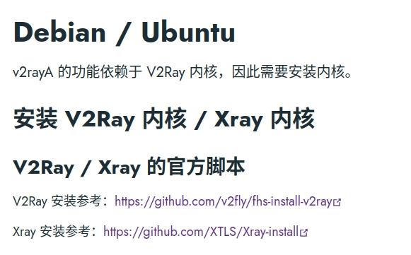
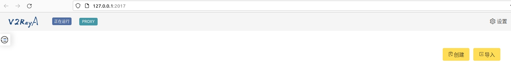
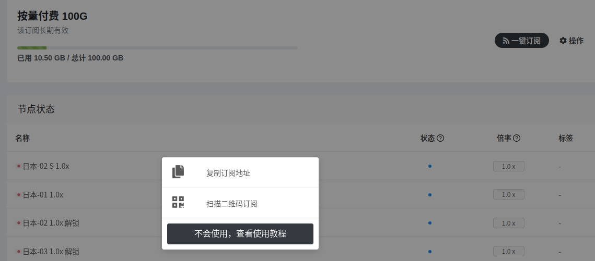
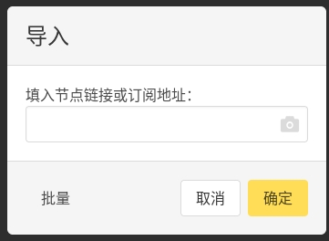
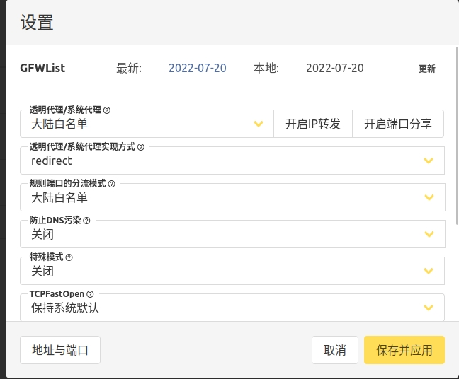

## 关于如何在ubuntu中使用SDKDNS的方法


### 1. 相关配置

```
Distributor ID:Ubuntu
Description:Ubuntu Kinetic Kudu (development branch)
Release:22.10
Codename:kinetic
Linux内核版本:5.15.0-27-generic

```


### 2. 安装准备

首先需要进入到[v2rayA官方文档](https://v2raya.org/docs/prologue/installation/debian/)，我们使用的是v2rayA这个网页版功能，所以需要有[v2ray](https://github.com/v2fly/fhs-install-v2ray)或者[Xray](https://github.com/XTLS/Xray-install)内核



我们使用Xray这个内核，输入以下命令（要使用**sudo命令**）

```bash
sudo bash -c "$(curl -L https://github.com/XTLS/Xray-install/raw/main/install-release.sh)" @ install
```

也可以安装制定的老版本

```bash
sudo bash -c "$(curl -L https://github.com/XTLS/Xray-install/raw/main/install-release.sh)" @ install --version 1.5.8
```

安装完成效果如下

```bash
xx@xx:~$ sudo bash -c "$(curl -L https://github.com/XTLS/Xray-install/raw/main/install-release.sh)" @ install
  % Total    % Received % Xferd  Average Speed   Time    Time     Time  Current
                                 Dload  Upload   Total   Spent    Left  Speed
  0     0    0     0    0     0      0      0 --:--:-- --:--:-- --:--:--     0
100 29812  100 29812    0     0   1793      0  0:00:16  0:00:16 --:--:--  7935
info: Installing Xray v1.5.5 for x86_64
Downloading Xray archive: https://github.com/XTLS/Xray-core/releases/download/v1.5.5/Xray-linux-64.zip
  % Total    % Received % Xferd  Average Speed   Time    Time     Time  Current
                                 Dload  Upload   Total   Spent    Left  Speed
  0     0    0     0    0     0      0      0 --:--:-- --:--:-- --:--:--     0
100 9669k  100 9669k    0     0  1886k      0  0:00:05  0:00:05 --:--:-- 2263k
info: Extract the Xray package to /tmp/tmp.JNfcHtOWRh and prepare it for installation.
rm: 无法删除 '/etc/systemd/system/xray.service.d/10-donot_touch_multi_conf.conf': 没有那个文件或目录
rm: 无法删除 '/etc/systemd/system/xray@.service.d/10-donot_touch_multi_conf.conf': 没有那个文件或目录
info: Systemd service files have been installed successfully!
warning: The following are the actual parameters for the xray service startup.
warning: Please make sure the configuration file path is correctly set.
# /etc/systemd/system/xray.service
[Unit]
Description=Xray Service
Documentation=https://github.com/xtls
After=network.target nss-lookup.target

[Service]
User=nobody
CapabilityBoundingSet=CAP_NET_ADMIN CAP_NET_BIND_SERVICE
AmbientCapabilities=CAP_NET_ADMIN CAP_NET_BIND_SERVICE
NoNewPrivileges=true
ExecStart=/usr/local/bin/xray run -config /usr/local/etc/xray/config.json
Restart=on-failure
RestartPreventExitStatus=23
LimitNPROC=10000
LimitNOFILE=1000000

[Install]
WantedBy=multi-user.target

# /etc/systemd/system/xray.service.d/10-donot_touch_single_conf.conf
# In case you have a good reason to do so, duplicate this file in the same directory and make your customizes there.
# Or all changes you made will be lost!  # Refer: https://www.freedesktop.org/software/systemd/man/systemd.unit.html
[Service]
ExecStart=
ExecStart=/usr/local/bin/xray run -config /usr/local/etc/xray/config.json

installed: /usr/local/bin/xray
installed: /usr/local/share/xray/geoip.dat
installed: /usr/local/share/xray/geosite.dat
installed: /usr/local/etc/xray/config.json
installed: /var/log/xray/
installed: /var/log/xray/access.log
installed: /var/log/xray/error.log
installed: /etc/systemd/system/xray.service
installed: /etc/systemd/system/xray@.service
removed: /tmp/tmp.JNfcHtOWRh
info: Xray v1.5.5 is installed.
You may need to execute a command to remove dependent software: apt purge curl unzip
Created symlink /etc/systemd/system/multi-user.target.wants/xray.service → /etc/systemd/system/xray.service.
info: Enable and start the Xray service

```

安装后可以关掉服务，因为 v2rayA 不依赖于该 systemd 服务。

```bash
sudo systemctl disable xray --now
```


### 3. v2rayA安装说明

我们可以去个github[下载deb包](https://github.com/v2rayA/v2rayA/releases)或者使用命令下载

```bash
sudo apt install /path/download/installer_debian_xxx_vxxx.deb 
```

启动 v2rayA

```bash
sudo systemctl start v2raya.service
```

设置开机自启动

```bash
sudo systemctl enable v2raya.service
```


### 4. 配置冲浪文件

启动服务后进入网页端（127.0.0.1:2017），点击**`导入`**



进入SDKDNS官网，找到`我的订阅` => `一键订阅` => `复制订阅地址`



将复制的订阅地址粘贴进这里面！



点击网页右上角的`设置`，设置透明代理/系统代理为**大陆白名单**，就能快乐自定义网上冲浪了

