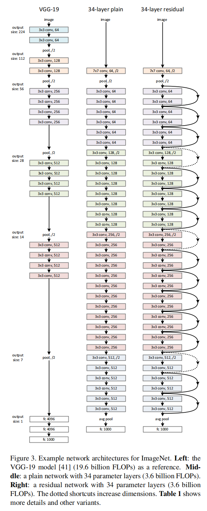

# ResNet论文总结

## 题目
《Deep Residual Learning for Image Recognition》

## 简介

本文关心的重点是如何让更深的神经网络更容易训练。

## Abstract（摘要）

>Deeper neural networks are more difficult to train. We present a residual learning framework to ease the training of networks that are substantially deeper than those used previously. We explicitly reformulate the layers as learning residual functions with reference to the layer inputs, instead of learning unreferenced functions. We provide comprehensive empirical evidence showing that these residual networksareeasiertooptimize, and can gain accuracy from considerably increased depth. On the ImageNet dataset we evaluate residual nets with a depth of up to 152 layers—8× deeper than VGG nets but still having lower complexity. An ensemble of these residual nets achieves 3.57% error on the ImageNettestset. This result won the 1st place on the ILSVRC 2015 classification task. We also present analysis on CIFAR-10 with 100 and 1000 layers.  
The depth of representations is of central importance for many visual recognition tasks. Solely due to our extremely deep representations, we obtain a 28% relative improvement on the COCO object detection dataset. Deep residual nets are foundations of our submissions to ILSVRC & COCO 2015 competitions1, where we also won the 1st places on the tasks of ImageNet detection, ImageNet localization, COCO detection, and COCO segmentation.

在`Abstract`第一段中，第一句提出了**深的神经网络在训练时会变得困难**这个问题，第二句中重点说明了**使用残差学习框架训练非常深的网络会比之前容易很多**。第三句讲了作者提出的**解决方法**就是**重新制定层作为学习残差函数相对于层输入的方法，而不是学习未参考的函数**。第四句说作者做的实验并说明残差网络非常好训练和得到很好的精度。剩下的就是与其他网络比较和参加的一些比赛。  

在`Abstract`第二段中，深度对于视觉识别的任务来说是很重要的，将网络换为残差网络就有28%的提升在CoCo数据集中，基于残差网络赢下了很多比赛。

## 1 Introduction（介绍）

在`Introduction`中，作者通过当今卷积神经网络在图像分类中取得的突破，网络深度是非常重要的，但是作者在下面提出了一个问题。

**提出的问题**

>Is learning better networks as easy as stacking more layers?

文章提出一个问题，学习更好的网络和叠加更多的层一样简单吗？这里也就是说是否层数越多能够让学习效果更好吗？

>An obstacle to answering this question was the notorious problem of vanishing/exploding gradients, which hamper convergence from the beginning.

当网络深会导致梯度爆炸或者梯度消失。

>When deeper networks are able to start converging, a degradationproblem has been exposed: with the network depth increasing, accuracy gets saturated (which might be unsurprising) and then degrades rapidly. Unexpectedly, such degradation is not caused by overfitting, and adding more layers to a suitably deep model leads tohigher training error, as reported in and thoroughly verified by our experiments. Fig.1shows a typical example.

当网络层数的加深，准确度**达到饱和并快速下降**，但是作者发现这种情况不是过拟合引起的，而是**在适当的深度模型中增加更多的层数导致的训练错误**。

在`figure_1`中，作者观察到普通网络越深（20层与56层做比较），训练和测试误差变高，这是需要解决的问题。

>In this paper, we address the degradation problem by introducing adeep residual learningframework. Instead of hoping each few stacked layers directly fit a desired underlying mapping, we explicitly let these layers fit a residual mapping. Formally, denoting the desired underlying mapping as H(x), we let the stacked nonlinear layers fit another mapping of F(x) := H(x) − x. The original mapping is recast intoF(x)+x. We hypothesize that it is easier to optimize the residual mapping than to optimize the original, unreferenced mapping. To the extreme, if an identity mapping were optimal, it would be easier to push the residual to zero than to fit an identity mapping by a stack of nonlinear layers.

这段提出了残差网络的方法，当我们**需要得到的学习结果**是`H(x)`，**浅层输出的x进入新加的层（在Figure_2中的两个weight layer）**，而**新加的层中学到的东西**（映射）我们记作`H(x) - x`，也就是说**新加的层中学到的东西**（映射）就是`F(x)`，**最终所学习出来的结果**就是`H(x) = F(x) + x`（浅层输入的`x`加上新加层中学出来的`F(x)`），这个就是所谓的残差学习。

>The formulation of F(x) +x can be realized by feedforward neural networks with “shortcut connections” (Fig.2). Shortcut connections are those skipping one or more layers. In our case, the shortcut connections simply perform identity mapping, and their outputs are added to the outputs of the stacked layers (Fig.2). Identity shortcut connections add neither extra parameter nor computational complexity. The entire network can still be trained end-to-end by SGD with backpropagation, and can be easily implemented using common libraries (e.g., Caffe [19]) without modifying the solvers.

这段就是告诉我们`residual`的作用，在神经网络要实现时我们需要使用一个叫`shortcut connections`的方法，它不会增加额外的参数也不会增加计算的复杂度，并且整个网络仍然是可以被训练的。

在`figure_2`中，作者展示了残差学习网络的一个基础的残差块的结构。

## 2 Related Work（相关工作）

**Residual Representations**：残差表示

**Shortcut Connections**：快捷连接

在`Related Work`中，残差表示和快捷连接这两个方法早在上个世纪神经网络时就已经被提出，这里是对两个方法在残差网络中更好的融合。

## 3 Deep Residual Learning（深度残差学习）

### 1.1 Residual Learning（残差学习）

>Let us consider H(x) as an underlying mapping to be fit by a few stacked layers (not necessarily the entire net), with x denoting the inputs to the first of these layers. If one hypothesizes that multiple nonlinear layers can asymptotically approximate complicated functions, then it is equivalent to hypothesize that they can asymptotically approximate the residual functions,i.e., H(x)−x (assuming that the input and output are of the same dimensions). So rather than expect stacked layers to approximate H(x), we explicitly let these layers approximate a residual function F(x) :=H(x) − x. The original function thus becomes F(x) + x. Although both forms should be able to asymptotically approximate the desired functions (as hypothesized), the ease of learning might be different.

我们考虑将H(x)作为几个堆叠层（不必是整个网络）要拟合的基础映射，xx表示这些层中第一层的输入。假设多个非线性层可以渐近地近似复杂函数，它等价于假设它们可以渐近地近似残差函数，即H(x)−x(假设输入输出是相同维度)。因此，我们明确让这些层近似参数函数 F(x):=H(x)−x，而不是期望堆叠层近似H(x)。因此原始函数变为F(x) + x。尽管两种形式应该都能渐近地近似要求的函数（如假设），但学习的难易程度可能是不同的。

>This reformulation is motivated by the counterintuitive phenomena about the degradation problem (Fig.1, left). As we discussed in the introduction, if the added layers can be constructed as identity mappings, a deeper model should have training error no greater than its shallower counterpart. The degradation problem suggests that the solvers might have difficulties in approximating identity mappings by multiple nonlinear layers. With the residual learning reformulation, if identity mappings are optimal, the solvers may simply drive the weights of the multiple nonlinear layers toward zero to approach identity mappings.

关于退化问题的反直觉现象激发了这种重构（`figure_1`，左）。正如我们在引言中讨论的那样，如果添加的层可以被构建为恒等映射，更深模型的训练误差应该不大于它对应的更浅版本。退化问题表明求解器通过多个非线性层来近似恒等映射可能有困难。通过残差学习的重构，如果恒等映射是最优的，求解器可能简单地将多个非线性连接的权重推向零来接近恒等映射。

>In real cases, it is unlikely that identity mappings are optimal, but our reformulation may help to precondition the problem. If the optimal function is closer to an identity mapping than to a zero mapping, it should be easier for the solver to find the perturbations with reference to an identity mapping, than to learn the function as a new one. We show byexperiments(Fig.7) that the learned residual functions in general have small responses, suggesting that identity mappings provide reasonable preconditioning.

在实际情况下，恒等映射不太可能是最优的，但是我们的重构可能有助于对问题进行预处理。如果最优函数比零映射更接近于恒等映射，则求解器应该更容易找到关于恒等映射的抖动，而不是将该函数作为新函数来学习。我们通过实验（`figure_7`）显示学习的残差函数通常有更小的响应，表明恒等映射提供了合理的预处理。

在`figure_7`中，在CIFAR-10上层响应的标准差。这些响应是每个3×3层的输出，在批量归一化（batch normalization）之后非线性之前。上面：以原始顺序显示层。下面：响应按降序排列。

### 3.2 Identity Mapping by Shortcut（快捷恒等映射）

在`Identity Mapping by Shortcut`中，作者每隔几个堆叠层就采用一个残差学习，后面都是对这个快捷恒等映射的公式说明，以下为方程1和方程2。

在`eqn_1`中，x和y是考虑的层的输入和输出向量。函数F(x, W_i)表示要学习的残差映射。

在`eqn_2`中，`eqn_1`中x和F的维度必须是相等的。如果不是这种情况（例如，当更改输入/输出通道时），我们可以通过快捷连接执行线性投影W_s来匹配维度，W_s仅在匹配维度时使用。

### 3.3 Network Architectures（网络架构）

在`figure_3`中，对于ImageNet的网络架构。左：以VGG-19模型作为参考（196亿浮点运算）。中：具有34个参数层的简单网络（36亿浮点运算）。右：具有34个参数层的残差网络（36亿浮点运算）。虚线的快捷连接增加了维度。表1显示了更多细节和其它变种。

>Plain Network. Our plain baselines (Fig. 3, middle) are mainly inspired by the philosophy of VGG nets [41] (Fig. 3, left). The convolutional layers mostly have 3×3 filters and follow two simple design rules: (i) for the same output feature map size, the layers have the same number of filters; and (ii) if the feature map size is halved, the number of filters is doubled so as to preserve the time complexity per layer. We perform downsampling directly by
convolutional layers that have a stride of 2. The network
ends with a global average pooling layer and a 1000-way
fully-connected layer with softmax.

**简单网络**：简单网络受到VGG网络为启发，用了更多的`3x3`的小卷积核，遵循了两个设计原则。（1）对于相同的输出特征图尺寸，层具有相同数量的滤波器；（2）如果特征图尺寸减半，则滤波器数量加倍，以便保持每层的时间复杂度。我们通过步长为2的卷积层直接执行下采样。网络以全局平均池化层和具有softmax的1000维全连接层结束。

>Residual Network. Based on the above plain network, we insert shortcut connections (Fig. 3, right) which turn the network into its counterpart residual version. The identity shortcuts (Eqn.(1)) can be directly used when the input and output are of the same dimensions (solid line shortcuts in Fig. 3). When the dimensions increase (dotted line shortcuts in Fig. 3), we consider two options: (A) The shortcut still performs identity mapping, with extra zero entries padded for increasing dimensions. This option introduces no extra parameter; (B) The projection shortcut in Eqn.(2) is used to match dimensions (done by 1×1 convolutions). For both options, when the shortcuts go across feature maps of two sizes, they are performed with a stride of 2.

**残差网络**：基于上述的简单网络，我们插入快捷连接（`figure_3`，右），将网络转换为其对应的残差版本。当输入和输出具有相同的维度时（`figure_3`中的实线快捷连接）时，可以直接使用恒等快捷连接（`eqn_1`）。  
当维度增加（`figure_3`中的虚线快捷连接）时，我们使用两个方法：（A）快捷连接仍然执行恒等映射，额外填充零输入以增加维度。此选项不会引入额外的参数；（B）方程（2）中的投影快捷连接用于匹配维度（由`1×1`卷积完成，注意`1x1`卷积的特点是在空间维度不做任何操作，但是在通道维度会做出改变）。对于这两个选项，当快捷连接跨越两种尺寸的特征图时，它们执行时步长为2。

### 3.4 Implementation（实现）

**训练**：

1. 短边随机采样到256和480，随机放大的好处是在切割时的随机性较好较多
2. 使用了图像增强，翻转，切割，颜色增强
3. 使用批量归一化（batch normalization）在每个卷积后和激活之前
4. 使用SGD，批量大小为256
5. 学习率为0.1，当误差稳定时学习率除以10
6. 权重衰减为0.0001，动量为0.9
7. 没有使用丢弃层，因为没有了全连接层

**测试**：10个标准的crop测试

## 4 Experiments

在`table_1`中，对于ImageNet架构。构建块显示在括号中（也可看图5），以及构建块的堆叠数量。下采样通过步长为2的conv3_1, conv4_1和conv5_1执行。

### 4.1 ImageNet Classification

在`figure_4`中，在ImageNet上训练的细曲线表示训练误差，粗曲线表示中心裁剪图像的验证误差。左：18层和34层的简单网络。右：18层和34层的残差网络。在本图中，残差网络与对应的简单网络相比没有额外的参数。

在`table_2`中，ImageNet验证集上的Top-1错误率(%，10个裁剪图像测试)。相比于对应的简单网络，ResNet没有额外的参数。图4显示了训练过程。

**简单网络**：

在`figure_4_l`中，显示的是34层和18层的普通网络结果。

作者用34层和18层的普通网络做了对照实验，在`figure_4`左边的图中蓝色的框显示出训练误差大于测试误差，这是由于训练时做了数据增强，而测试中的噪音较少，导致了如上结果。灰色的框代表在误差稳定的时候，学习率除以10。在绿色的框中我们可以发现34层的简单网络的误差比18层的简单网络的误差要大。

**残差网络**：

在`figure_4_r`中，显示的是34层和18层的残差网络结果。

作者用34层和18层的残差网络做了对照实验，在`figure_4`右边的图中灰色的框代表在误差稳定的时候，学习率除以10。在绿色的框中我们可以发现34层的残差网络的误差比18层的残差网络的误差要小了很多。

在`table_3`中，ImageNet验证集错误率（%，10个裁剪图像测试）。VGG16是基于我们的测试结果的。ResNet-50/101/152的选择B仅使用投影增加维度。

**恒等和投影快捷连接**：

>In Table 3 we compare three options: (A) zero-padding shortcuts are used for increasing dimensions, and all shortcuts are parameterfree (the same as Table 2 and Fig.4 right); (B) projection shortcuts are used for increasing dimensions, and other shortcuts are identity; and (C) all shortcuts are projections.   
Table 3 shows that all three options are considerably better than the plain counterpart. B is slightly better than A. We argue that this is because the zero-padded dimensions in A indeed have no residual learning. C is marginally better than B, and we attribute this to the extra parameters introduced by many (thirteen) projection shortcuts. But the small differences among A/B/C indicate that projection shortcuts are not essential for addressing the degradation problem. So we do not use option C in the rest of this paper, to reduce memory/time complexity and model sizes. Identity shortcuts are particularly important for not increasing the complexity of the bottleneck architectures that are introduced below.

恒等快捷连接有助于训练，三个方法：
1. A方法：零填充快捷连接用来增加维度，所有的快捷连接是没有参数的（与`table_2`和`figure_4`的右图相同）
2. B方法：投影快捷连接用来增加维度，其它的快捷连接是恒等的
3. C方法：所有的快捷连接都是投影。
作者发现使用C方法的比B方法稍好，并且差距细微，使用C方法效果好但是带来了大量的计算复杂度。现在的ResNet都是用的B方法，当输入和输出发生改变的时候，会用`1*1`卷积做一次投影。

**更深的瓶颈结构**：

在`figure_5`中，对于ImageNet的深度残差函数F。左：构建一个ResNet-34的块（在56×56的特征图上），如图3。右：构建一个ResNet-50/101/152的“bottleneck”块。

左图中我们可以看见输入通道为64，右图为256。从中我们可以知道右图的通道数是左图的4倍，相应的计算复杂度变为了左图的16倍。右图中通过一个`1x1`的卷积将256的通道映射投影回64，然后在第二个`3x3`通道数不变的卷积（和左图中第二个`3x3`卷积作用相同）中进行运算，在第三个`1x1`的卷积中再将通道数投影为256。通过以上方法，使得ResNet-34与ResNet-50的复杂度是差不多的。

在`table_4`中，对于自己的比较，随着深度的增加，错误率下降。

在`table_5`中，与其它方法进行比较，获得了3.57的测试错误率。

### 4.2 CIFAR-10 and Analysis

在`table_6`中，在CIFAR-10测试集上的分类误差。所有的方法都使用了数据增强。对于ResNet-110，像论文[R. K. Srivastava, K. Greff, and J. Schmidhuber. Highway networks.arXiv:1505.00387, 2015.]中那样，我们运行了5次并展示了“最好的(mean ± std)”。

作者又在CIFAR上做了实验，作者设计了很多ResNet模型（20/32/44/56/110/1202），在100多层时错误率还是有往下降的趋势，但是在1000层后出现了增加，作者认为这是由于过拟合导致的。

在`figure_6`中，在CIFAR-10上训练。虚线表示训练误差，粗线表示测试误差。左：简单网络。简单的110层网络错误率超过60%没有展示。中间：ResNet。右：110层ResNet和1202层ResNet。

以上图片和`4.1`中的ImageNet分类结果相似。

在`figure_7`中，CIFAR-10上各层响应的标准偏差(std)。响应是每个3×3层的输出，在批量归一化之后和非线性之前的输出。顶部：图层按其原始顺序显示。底部：响应按降序排列。

作者看最后的那些层有没有用，如果没有学习到东西，最后的层是不增加输入的时候，他们的输出基本上为0。

### 4.3 Object Detection on PASCAL and MS COCO

目标检测的应用。