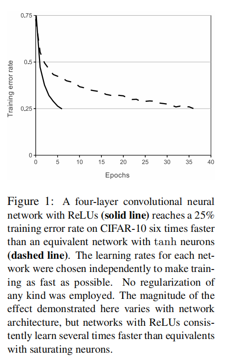
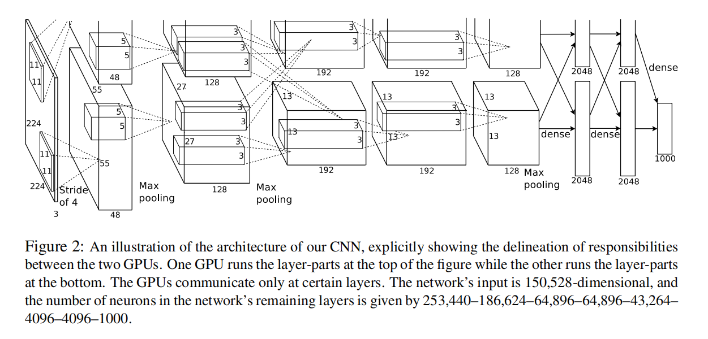
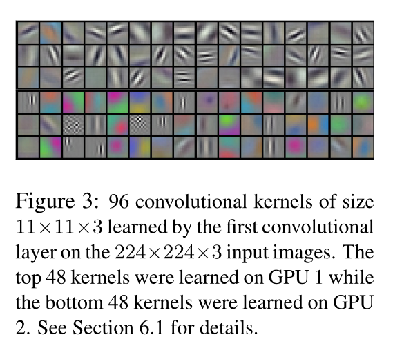
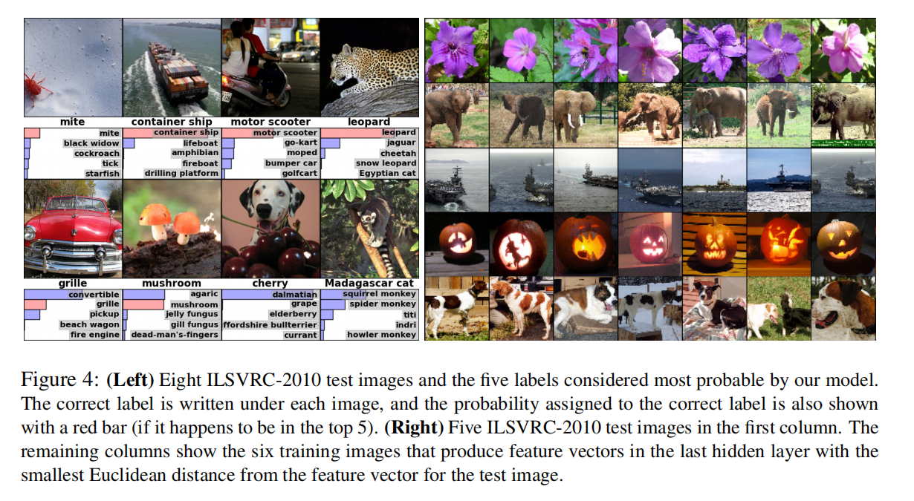

# AlexNet论文整理

___

## 题目
《ImageNet Classification with Deep Convolutional Neural Networks》

## 简介
AlexNet属于一个更大更深的LeNet  

改进有以下三点：
1. 增加了dropout层（丢弃层）
2. 激活函数从Sigmoid变为ReLu，作用是减缓梯度消失
3. 增加了MaxPooling（最大池化层），作用是取最大值，梯度相对较大，比较好训练  

这个AlexNet论文具体段落分析在PDF中，md文件仅做总结

## Abstract

> We trained a large, deep convolutional neural network to classify the 1.2 million
high-resolution images in the ImageNet LSVRC-2010 contest into the 1000 dif-
ferent classes. On the test data, we achieved top-1 and top-5 error rates of 37.5%
and 17.0% which is considerably better than the previous state-of-the-art. The
neural network, which has 60 million parameters and 650,000 neurons, consists
of five convolutional layers, some of which are followed by max-pooling layers,
and three fully-connected layers with a final 1000-way softmax. To make train-
ing faster, we used non-saturating neurons and a very efficient GPU implemen-
tation of the convolution operation. To reduce overfitting in the fully-connected
layers we employed a recently-developed regularization method called “dropout”
that proved to be very effective. We also entered a variant of this model in the
ILSVRC-2012 competition and achieved a winning top-5 test error rate of 15.3%,
compared to 26.2% achieved by the second-best entry.

总结下就是介绍了AlexNet这个模型使用了一个又大又深的卷积神经网络分类了120万张高分辨率的图片，
并且参加了ImageNet里的一些比赛并取得了比较好的成绩。介绍了这个神经网络的参数、神经元、结构等，并
使用了高性能的GPU进行训练，接着又介绍了解决过拟合使用了丢弃法。

## 1 Introduction

在`Introduction`这个章节中，**第一段**说识别物体主要使用在机器学习方法中，收集比较大的数据集和更强
的模型，用更好的技术去防止过拟合。然后第一段后部分说我们使用了ImageNet这个数据集，吹了一波这个
数据集的图片多，分辨率好还有种类多。**第二段**说CNN是个很好的模型，我们需要用它来做深度学习（`注意：
这里并没有与其它的方法做比较，只提CNN，在自己写论文时这里应该加上作比较`）。**第三段**提到CNN不好
训练什么的，需要很大的资源开销，但是在这里有GPU进行计算，并方便训练CNN。**第四段**提到论文的贡献、新技术、
方法等等，总结就是四部分，一是用GPU做2D卷积；二是网络新功能；三是有效方法介绍过拟合；四是深层的网络
很重要。**第五段**讲GPU。

## 2 The Dataset

在`The Dataset`这个章节中，**第一段**讲了ImageNet这个数据集图片多，分辨率好还有种类多。**第二段**
讲ILSVRC这个比赛数据集。**第三段**讲图片分辨率不同，然后这个模型把这些图片按照一定的方式划分256x256的格
式，并以原始图片输入。

## 3 The Architecture

### 3.1 ReLU Nonlinearity



在`ReLU Nonlinearity`这个章节里，主要就是说ReLu函数比传统的那些tanh、sigmoid函数要好，在CNN
中有更快的表现。图中的实线代表ReLU，虚线代表tanh

### 3.2 Training on Multiple GPUs

在`Training on Multiple GPUs`这个章节里，讲了用多个GPU进行训练。

### 3.3 Local Response Normalization

在`Local Response Normalization`这个章节里，讲了输入归一化，那个公式基本没人用目前。

### 3.4 Overlapping Pooling

在`Overlapping Pooling`这个章节里，CNN中的池化层总结了同一核图中相邻神经元组的输出，然后作者发现
在训练中观察到使用重叠池化层的模型不易过拟合。

### 3.5 Overall Architecture



在`Overall Architecture`这个章节里，**第一段**讲了AlexNet这个模型的结构是有八个含有权重的层，
由五层卷积层和三层全连接层构成。**第二段**讲了卷积核、卷积层、池化层和全连接层的关系。**第三段**讲
了每一层的输入、输出等。具体的实现在[pytorch learning](https://github.com/chairc/daily-learning/blob/main/pytorch-learning/004_pytorch_%E7%8E%B0%E4%BB%A3%E5%8D%B7%E7%A7%AF%E7%A5%9E%E7%BB%8F%E7%BD%91%E7%BB%9C/00_AlexNet_%E7%8E%B0%E4%BB%A3%E5%8D%B7%E7%A7%AF%E7%A5%9E%E7%BB%8F%E7%BD%91%E7%BB%9C%EF%BC%88AlexNet%EF%BC%89/00_AlexNet%E7%9A%84%E5%AE%9E%E7%8E%B0.py)
中。

```python
net = nn.Sequential(
    # 卷积层C1
    # 使用11*11的卷积核并使用步幅为4来捕捉对象，以减小输出的行高和列宽
    # AlexNet初始输入224*224*3，这里如果按224输入则下面会变为54*54，所以按227输入
    # 卷积：(227+2-11+4)/4 = 55.5  ->  55*55  ->  55*55*96
    nn.Conv2d(3, 96, kernel_size=11, stride=4, padding=1), nn.ReLU(),
    # 池化：(55-3+2)/2 = 27  ->  27*27*96
    nn.MaxPool2d(kernel_size=3, stride=2),
    # 当前输出：27*27*96

    # 卷积层C2
    # 减小卷积窗口，使用填充为2来使输入和输出的行高和列宽一致，增大输出通道
    # 卷积：(27+4-5+1)/1 = 27  ->  27*27  ->  27*27*256
    nn.Conv2d(96, 256, kernel_size=5, padding=2), nn.ReLU(),
    # 池化：(27-3+2)/2 = 13  ->  13*13
    nn.MaxPool2d(kernel_size=3, stride=2),
    # 当前输出：13*13*256

    # 使用三个连续的卷积层和较小的卷积窗口
    # 卷积层C3
    # 卷积：(13+2-3+1)/1 = 13  ->  13*13*384
    nn.Conv2d(256, 384, kernel_size=3, padding=1), nn.ReLU(),
    # 当前输出：13*13*384

    # 卷积层C4
    # 卷积：(13+2-3+1)/1 = 13  ->  13*13*384
    nn.Conv2d(384, 384, kernel_size=3, padding=1), nn.ReLU(),
    # 当前输出：13*13*384

    # 卷积层C5
    # 卷积：(13+2-3+1)/1 = 13  ->  13*13*256
    nn.Conv2d(384, 256, kernel_size=3, padding=1), nn.ReLU(),
    # 当前输出：13*13*256
    # 卷积：(13-3+2)/2 = 6  -> 6*6*256
    nn.MaxPool2d(kernel_size=3, stride=2),
    # 当前输出：6*6*256

    # 全连接层FC6
    nn.Flatten(),
    # 使用dropout减少过拟合
    nn.Linear(6400, 4096), nn.ReLU(),
    nn.Dropout(p=0.5),
    nn.Linear(4096, 4096), nn.ReLU(),
    nn.Dropout(p=0.5),
    nn.Linear(4096, 1000)
)
```

## 4 Reducing Overfitting

### 4.1 Data Augmentation

在`Data Augmentation`这个章节里，**第一段**讲了在处理过拟合的时候，最简单和最通用的方式就是进行数据
增强，然后采用了两种方式进行增强。**第二段**讲了AlexNet第一种增强方式，这个模型将256*256的图片中随
机取224*224块来输入中固定大小的图片，并做水平翻转，扩大数据集。**第三段**讲了AlexNet第二种增强方式，
改变训练图片的RGB通道值，对图片的RGB像素进行PCA（主成分分析）。这个方案大约捕捉自然图像的一个重要性质 ,
即对象身份不变的照明的强度和颜色的变化。

### 4.2 Dropout

在`Dropout`这个章节里，讲了AlexNet采用dropout方法，通过设定丢弃率为0.5将矩阵中的单元随机置为0。没
又实用dropout，神经网络会很容易过拟合。

## 5 Details of learning
在`Details of learning`这个章节里，**第一段**AlexNet使用了SGD算法，他们发现使用权重衰退是一个
很重要的模型学习方法，权重衰退减少了模型训练的错误。**第二段**模型初始化了权重均值为0，标准差为0.01
的高斯分布，模型的偏移在第2、4、5的卷积层和全连接层置为1，其它都置为0（后期发现偏移为0也有不错的效果）
**第三段**讲了使用相同学习速度，在整个训练过程中我们手动调整（手动炼丹:joy:）。当验证错误率随当前学
习率停止提高时（也就是发现错误率提高了），采用的启发式方法是将学习率除以10。

## 6 Result

在`Result`这个章节里，讲了将比赛结果总结到表中。

### 6.1 Qualitative Evaluations



在`Qualitative Evaluations`这个章节里，GPU 1上的内核大部分是不区分颜色的，而GPU 2上的内核大
部分是特定颜色的。




在左边八张图中展示的模型分类后的结果，右边的这些图是根据每行的第一个图片为基准，找到从第二个开始到最后
一个相似的图片。作者得出结论，特征激活向量的欧几里德距离相差较小的话，可以认为两张图片是相似的。

## 7 Discussion

在`Discussion`这个章节里，作者从结构中得出结论：一个大型的深度卷积神经网络能够在一个高度挑战性的数
据集上使用纯监督式学习获得破记录的结果，所以深度是实现结果很重要的一点。