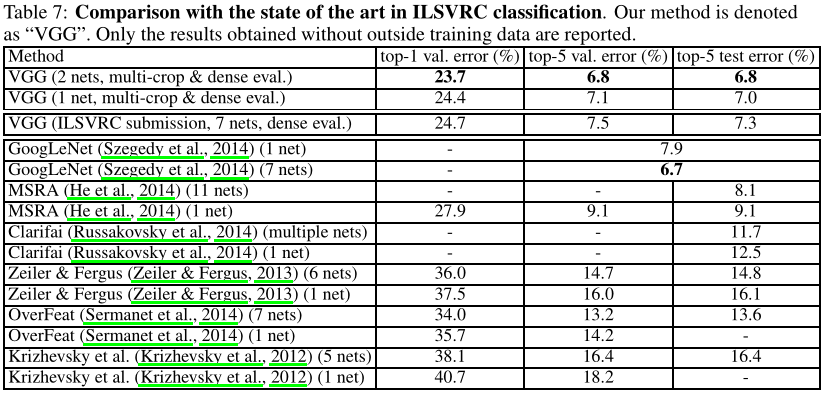

# VGG论文总结

## 题目
《Very Deep Convolutional Networks for Large-Scale Image Recognition》

## 简介


## Abstract

>In this work we investigate the effect of the convolutional network depth on its accuracy in the large-scale image recognition setting. Our main contribution is a thorough evaluation of networks of increasing depth using an architecture with very small (3×3) convolution filters, which shows that a significant improvement on the prior-art configurations can be achieved by pushing the depth to 16–19 weight layers. These findings were the basis of our ImageNet Challenge 2014 submission, where our team secured the first and the second places in the localisa- tion and classification tracks respectively. We also show that our representations generalise well to other datasets, where they achieve state-of-the-art results. We have made our two best-performing ConvNet models publicly available to facilitate further research on the use of deep visual representations in computer vision.

在`Abstract`中，文章主要研究卷积深度对识别精度的影响，并且利用了**3x3**的卷积核来加深对网络的评估，表明通过将深度提升到16-19个权重层，能得到较好的性能。

## 1 Introduction

在`Introduction`节中，首先说明对卷积网络的成功是因为公开数据集和高性能计算，接着讨论了结构设计——深度，使用`3x3`卷积核并增加卷积层来增加网络的深度。 

**论文结构**：  
1. Section 2——描述卷积网络设置
2. Section 3——图像分类训练和评估
3. Section 4——在ILSVRC分类任务上对不同框架进行了对比
4. Section 5——论文总结  

## 2 ConvNet Configurations

在`ConvNet Configurations`节中，在Section 2.1中描述了通用对象配置，在Section 2.2中评估配置，在Section 2.3中讨论设计选择和比较当前技术。

### 2.1 Architecture

  

>During training, the input to our ConvNets is a fixed-size 224×224 RGB image. The only preprocessing we do is subtracting the mean RGB value, computed on the training set, from each pixel. The image is passed through a stack of convolutional (conv.) layers, where we use filters with a very small receptive field:3×3(which is the smallest size to capture the notion of left/right, up/down, center). In one of the configurations we also utilise1×1convolution filters, which can be seen as a linear transformation of the input channels (followed by non-linearity). The convolution stride is fixedto1pixel; the spatial padding of conv. layer input is such that the spatial resolution is preserved after convolution, i.e. the padding is1pixel for3×3conv. layers. Spatial pooling is carried out by five max-poolinglayers, which follow some of the conv. layers (not all the conv. layers are followed by max-pooling). Max-pooling is performed over a2×2pixel window, with stride2.  

在`Architecture`小节中，首先输入的图片为`224x224`的RGB图片。  
**卷积层**：  
1. 卷积核使用`3x3`和在一种配置中使用`1x1`的类型
2. 步幅设置为`1`
3. 填充用来**保持**卷积后输出图片的**原来大小分辨率**

**池化层**：
1. 一共设置5个最大池化层
2. 使用`2x2`的滑动窗口
3. 滑动步幅为`2`  

>A stack of convolutional layers (which has a different depth in different architectures) is followed by three Fully-Connected (FC) layers: the first two have 4096 channels each, the third performs 1000- way ILSVRC classification and thus contains 1000 channels (one for each class). The final layer is the soft-max layer. The configuration of the fully connected layers is the same in all networks.

**全连接层**：在卷积后有3个全连接层，第一个和第二个拥有4096个通道，第三个有1000个通道，最后含有一个`soft-max`层

>All hidden layers are equipped with the rectification (ReLU (Krizhevsky et al., 2012)) non-linearity.  

**隐藏层**：使用激活函数ReLU  

**代码实现**：

```python
# 定义一个VGG块
def vgg_block(num_convs, in_channels, out_channels):
    layers = []
    for _ in range(num_convs):
        layers.append(nn.Conv2d(
            in_channels, out_channels, kernel_size=3, padding=1
        ))
        layers.append(nn.ReLU())
        # 下一层的输入通道等于上一层的输出通道
        in_channels = out_channels
    layers.append(nn.MaxPool2d(kernel_size=2, stride=2))
    return nn.Sequential(*layers)


# 5个卷积块，第1、2个块有1个卷积层，第3、4、5个块有2个卷积层，一共有8个卷积层，加上3个全连接层，一共有11层结构，称作VGG-11
conv_arch = ((1, 64), (1, 128), (2, 256), (2, 512), (2, 512))


def vgg(conv_arch):
    conv_blocks = []
    in_channels = 1
    # 卷积层部分，把VGG块拼接到一块
    for (num_convs, out_channels) in conv_arch:
        conv_blocks.append(vgg_block(num_convs, in_channels, out_channels))
        in_channels = out_channels

    return nn.Sequential(
        *conv_blocks, nn.Flatten(),
        # 全连接层
        nn.Linear(out_channels * 7 * 7, 4096), nn.ReLU(), nn.Dropout(0.5),
        nn.Linear(4096, 4096), nn.ReLU(), nn.Dropout(0.5),
        nn.Linear(4096, 1000)
    )

```

**VGG输出结构**：


```python

Sequential(
  (0): Sequential(
    (0): Conv2d(3, 64, kernel_size=(3, 3), stride=(1, 1), padding=(1, 1))
    (1): ReLU()
    (2): MaxPool2d(kernel_size=2, stride=2, padding=0, dilation=1, ceil_mode=False)
  )
  (1): Sequential(
    (0): Conv2d(64, 128, kernel_size=(3, 3), stride=(1, 1), padding=(1, 1))
    (1): ReLU()
    (2): MaxPool2d(kernel_size=2, stride=2, padding=0, dilation=1, ceil_mode=False)
  )
  (2): Sequential(
    (0): Conv2d(128, 256, kernel_size=(3, 3), stride=(1, 1), padding=(1, 1))
    (1): ReLU()
    (2): Conv2d(256, 256, kernel_size=(3, 3), stride=(1, 1), padding=(1, 1))
    (3): ReLU()
    (4): MaxPool2d(kernel_size=2, stride=2, padding=0, dilation=1, ceil_mode=False)
  )
  (3): Sequential(
    (0): Conv2d(256, 512, kernel_size=(3, 3), stride=(1, 1), padding=(1, 1))
    (1): ReLU()
    (2): Conv2d(512, 512, kernel_size=(3, 3), stride=(1, 1), padding=(1, 1))
    (3): ReLU()
    (4): MaxPool2d(kernel_size=2, stride=2, padding=0, dilation=1, ceil_mode=False)
  )
  (4): Sequential(
    (0): Conv2d(512, 512, kernel_size=(3, 3), stride=(1, 1), padding=(1, 1))
    (1): ReLU()
    (2): Conv2d(512, 512, kernel_size=(3, 3), stride=(1, 1), padding=(1, 1))
    (3): ReLU()
    (4): MaxPool2d(kernel_size=2, stride=2, padding=0, dilation=1, ceil_mode=False)
  )
  (5): Flatten(start_dim=1, end_dim=-1)
  (6): Linear(in_features=25088, out_features=4096, bias=True)
  (7): ReLU()
  (8): Dropout(p=0.5, inplace=False)
  (9): Linear(in_features=4096, out_features=4096, bias=True)
  (10): ReLU()
  (11): Dropout(p=0.5, inplace=False)
  (12): Linear(in_features=4096, out_features=10, bias=True)
)

```

### 2.2 Configuration

  

在`Table 1`中，可以看出从A（11层）到E（19层），深度是依次递增的。

  

在`Table 2`中，展示的是从A（11层）到E（19层）的参数数量。  

### 2.3 Discussion

>Our ConvNet configurations are quite different from the ones used in the top-performing entries of the ILSVRC-2012 (Krizhevsky et al., 2012) and ILSVRC-2013 competitions (Zeiler & Fergus, 2013; Sermanet et al., 2014). Rather than using relatively large receptive fields in the first conv. lay- ers (e.g.11×11 with stride4in (Krizhevsky et al., 2012), or7×7with stride2in (Zeiler & Fergus, 2013; Sermanet et al., 2014)), we use very small 3×3 receptive fields throughout the whole net, which are convolved with the input at every pixel (with stride1). 

在这里作者说VGG这个网络与之前的那些人的网络不同，将`11x11`或`7x7`的卷积核变成了更小的`3x3`卷积核。  

>It is easy to see that a stack of two 3×3 conv. layers (without spatial pooling in between) has an effective receptive field of5×5; three such layers have a 7×7 effective receptive field.

这里作者发现如果说**2个**`3x3`的卷积串联，那么将等于**1个**`5x5`的卷积，同理**3个**`3x3`的卷积串联，那么将等于**1个**`7x7`的卷积。  

>So what have we gained by using, for instance, a stack of three 3×3 conv. layers instead of a single 7×7 layer? 

作者提出为什么要用**3个**`3x3`的卷积替代**1个**`7x7`的卷积？

>First, we incorporate three non-linear rectification layers instead of a single one, which makes the decision function more discriminative. Second, we decrease the number of parameters: assuming that both the input and the output of a three-layer 3×3 convolution stack has C channels, the stack is parametrised by 3(3²C²) = 27C² weights; at the same time, a single 7×7 conv. layer would require7²C²= 49C²parameters, i.e. 81% more.

作者在这里对上面提出的问题做出了回答，第一点3层比1层更具有判别性，使用更多的非线性变换，特征学习能力更强；第二点`3x3`的卷积相比于`7x7`的卷积减少了参数。  

## 3 Classification Framework

### 3.1 Training

>Namely, the training is carried out by optimising the multinomial logistic regression objective using mini-batch gradient descent (based on back-propagation (LeCun et al., 1989)) with momentum. The batch size was set to 256, momentum to 0.9. The training was regularised by weight decay (the L2 penalty multiplier set to 5·10^(−4)) and dropout regularisation for the first two fully-connectedlayers (dropoutratio set to 0.5). The learning rate was initially set to 10^(−2), and then decreased by a factor of 10 when the validation set accuracy stopped improving. In total, the learning rate was decreased 3 times, and the learning was stopped after370K iterations (74 epochs). We conjecture that in spite of the larger number of parameters and the greater depth of our nets compared to (Krizhevsky et al., 2012), the nets required less epochs to converge due to (a) implicit regularisation imposed by greater depth and smaller conv. filter sizes; (b) pre-initialisation of certain layers.

在训练时，使用带动量的最小批梯度下降算法（mini-batch gradient descent with momentum），批量大小设置为256，动量设置为0.9，训练时使用权重衰减，在第一和第二个全连接层使用丢弃率为0.5的丢弃层，学习率设置为0.01，当验证精度停止提高时，学习率降低10倍。VGG相比于AlexNet训练收敛快的原因是**拥有更深的网络和更小的卷积，还有一些层的预初始化**。

>The initialisation of the network weights is important, since bad initialisation can stall learning due to the instability of gradient in deep nets. To circumvent this problem, we began with training the configuration A (Table 1), shallow enough to be trained with random initialisation. Then, when trainingdeeperarchitectures, we initialised the first fourconvolutionallayers andthe last three fully-connectedlayers with the layers of net A (the intermediatelayers were initialised randomly). We did not decrease the learning rate for the pre-initialised layers, allowing them to change during learning. For random initialisation (where applicable), we sampled the weights from a normal distribution with the zero mean and 10^(−2) variance. The biases were initialised with zero.

这里作者说不好的初始化会导致学习的失败，在**表1**中的配置A，网络较浅的可以采用随机初始化。当训练更深的网络结构时，**使用模型A的权重来初始化前四层和最后三层全连接层的参数，其他中间层使用随机初始化**

> To further augment the training set, the crops underwent random horizontal flippingandrandomRGB colourshift 

这里就是输入图片时进行的数据增强。

**训练图片大小**：选取一个固定的最短边S，然后在S上截取大小为`224×224`的区域。

方法一：选取一个固定的S，相当于单一尺度训练，评估选取两个固定的S，分别为256和384。对于一个给定的神经网络配置，首先训练S=256。为了加速训练S=384的网络，会使用预训练的S=256网络的权重来初始化参数，然后使用更好的初始化学习速率10^(-3)。

方法二：设置S为多尺度，每次训练图片，都通过从一确定的范围[Smin, Smax]（通常值为Smin=256、Smax=512）随机采样一个S，使用此S来缩放图片。因为图片中的物体有不同的尺寸，通过S多尺度，这样的情况就被考虑了进去。

### 3.2 Testing

> Namely, the fully-connected layers are first converted to convolutional layers (the first FC layer to a 7×7 conv. layer, the last two FC layers to 1×1 conv. layers). The resulting fully-convolutional net is then applied to the whole (uncropped) image. The result is a class score map with the number of channels equal to the number of classes, and a variable spatial resolution, dependent on the input image size.

训练时的全连接层在测试时依次变为1个`7x7`的卷积和2个`1x1`卷积。经过转换的网络就没有了全连接层，这样网络就可以接受任意尺寸的输入，而不是像之前之能输入固定大小的输入。

### 3.3 Implementation Details

在`Implementation Details`小节中，讲了使用实现VGG的工具和硬件设备。

## 4 Classification Experiments

在`Classification Experiments`节中，介绍如单尺寸评估（Single Scale Evaluation）、多尺寸评估（Multi-scale Evaluation）、多裁剪评估（Multi-crop Evaluation）、神经网络融合（ConvNet Fusion）和与其他SOTA模型比较（Comparison with The State of The Art）。

**数据集**：
1. 数据种类：1000类
2. 训练集：130万张图片
3. 验证集：5万张图片
4. 测试集：10万张图片

### 4.1 Single Scale Evaluation

  

在`Table 3`中，展示为单尺寸测试的性能

**实验结论一**：

>we note that using local response normalisation (A-LRN network) does not improve on the model A without any normalisation layers. We thus do not employ normalisation in the deeper architectures (B–E).

这里说相比于A和A-LRN，LRN层无性能增益。所以在之后的四个网络中就不在出现标准化了。

**实验结论二**：

> we observe that the classification error decreases with the increased ConvNet depth: from 11 layers in A to 19 layers in E. 

随着深度的增加误差减少，性能提升。

**实验结论三**：


>Notably, in spite of the same depth, the configuration C (which contains three1×1conv. layers), performs worse than the configuration D, which uses 3×3 conv.

如上图所示，在深度都为16层的情况下，后三层使用`1x1`卷积的C与使用`3x3`卷积的D性能要差。


>This indicates that while the additional non-linearity does help (C is
better than B), it is also important to capture spatial context by using conv.

如上图所示，当深度不同时，拥有`1x1`卷积的C性能比B好，说明增加非线性是有所帮助的。

**实验结论四**：

>scale jittering at training time (S∈[256; 512]) leads to significantly better results than training on images with fixed smallest side (S= 256 or S= 384), even though a single scale is used at test time. This confirms that training set augmentationby scale jittering is indeed helpful for capturing multi-scale image statistics.

尺寸抖动比固定边有更好的结果，说明训练时靠尺寸都能会有所帮助。

### 4.2 Multi-scale Evaluation

  

在`Table 4`中，展示为多尺寸测试的性能

>The results, presented in Table 4, indicate that scale jittering at test time leads to better performance (as compared to evaluating the same model at a single scale, shown in Table 3). As before, the deepest configurations (D and E) perform the best, and scale jittering is better than training with a fixed smallest sideS. 

在**测试时使用尺寸抖动会有更好的表现**（与相同的模型在单尺寸相比），并且**越深的模型表现越好**，尺寸抖动比使用固定最小边S训练的模型更好。

### 4.3 Multi-crop Evaluation

  

在`Table 5`中，展示为网络评估技术比较

从上图可以看出，多裁剪评估（multi-crop evaluation）方法要好于密集评估（dense evaluation），如果将**两者结合起来会有更好的效果**。

### 4.4 ConvNet Fusion

  

在`Table 6`中，展示为多重神经网络融合结果

多模型融合是基于多个网络softmax输出的结果的平均。

### 4.5 Comparison with The State of The Art

  

在`Table 7`中，展示与其他SOTA模型比较

## 5 Conclusion

>In this work we evaluated very deep convolutional networks (up to 19 weight layers) for large-scale image classification. It was demonstrated that the representation depth is beneficial for the classification accuracy, and that state-of-the-art performance on the ImageNet challenge dataset can be achievedusing a conventionalConvNetarchitecture(LeCun et al., 1989; Krizhevsky et al., 2012) with substantially increased depth.

在`Conclusion`节中，**最终结论表示深度有利于分类的准确性**。
