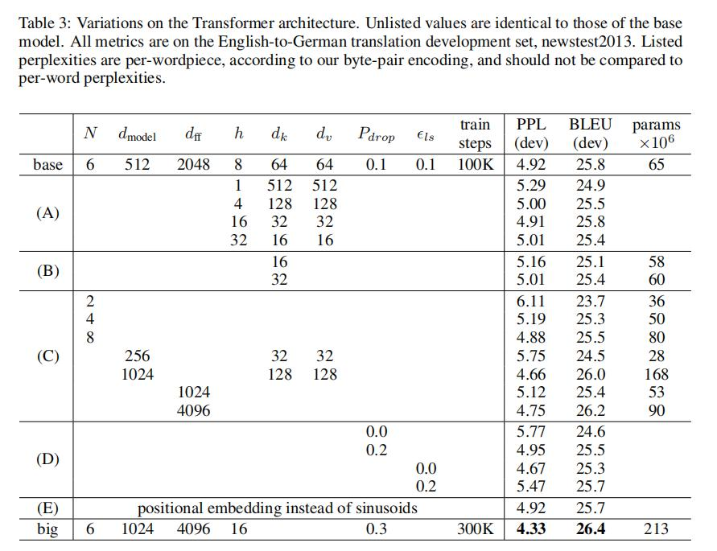

# Attention Is All You Need论文总结

## 题目
《Attention Is All You Need》

## 简介

《Attention Is All You Need》论文总结

## Abstract（摘要）

>The dominant sequence transduction models are based on complex recurrent or
convolutional neural networks that include an encoder and a decoder. The best performing models also connect the encoder and decoder through an attention mechanism. We propose a new simple network architecture, the Transformer, based solely on attention mechanisms, dispensing with recurrence and convolutions entirely. Experiments on two machine translation tasks show these models to be superior in quality while being more parallelizable and requiring significantly less time to train. Our model achieves 28.4 BLEU on the WMT 2014 English to-German translation task, improving over the existing best results, including ensembles, by over 2 BLEU. On the WMT 2014 English-to-French translation task, our model establishes a new single-model state-of-the-art BLEU score of 41.8 after training for 3.5 days on eight GPUs, a small fraction of the training costs of the best models from the literature. We show that the Transformer generalizes well to other tasks by applying it successfully to English constituency parsing both with large and limited training data.

在`Abstract`中，占据主要地位的**Sequence Transduction**（时序转导，属于NLP方向）是基于复杂的循环和卷积神经网络，其中包括一个encoder（编码器）和一个decoder（解码器），性能最好的模型是通过**attention mechanism**（注意力机制）连接的encoder（编码器）和decoder（解码器）。本文提出了一个简单的网络架构，是基于**attention mechanism**（注意力机制）的**Transformer模型**，这种模型**完全去除掉了循环和卷积神经网络**。通过两个翻译任务的实验中证实这种模型在训练的**并行性更好，时间更少**。

## 1 Introduction（介绍）

>Numerous efforts have since continued to push the boundaries of recurrent language models and encoder-decoder architectures.

在`Introduction`中，第一段首先说了当前两种主流的模型：（1）语言模型；（2）encoder-decoder模型。

>Recurrent models typically factor computation along the symbol positions of the input and output sequences. Aligning the positions to steps in computation time, they generate a sequence of hidden states h_t, as a function of the previous hidden state h_(t−1) and the input for position t.

第二段先说了时序计算是通过位置进行输入和输出的时序，从左向右依次计算或者从右向左依次计算。

>This inherently sequential nature precludes parallelization within training examples, which becomes critical at longer sequence lengths, as memory constraints limit batching across examples.

这种时序计算带来了两个问题：（1）RNN计算**并行性较差**，从而导致了计算性能的低下；（2）时序较长的情况会导致**早期时序信息在后期会被丢弃**，如果考虑不被丢弃，就会增加h_t的长度，从而进一步导致内存开销变大。

>Recent work has achieved significant improvements in computational efficiency through factorization tricks and conditional computation, while also improving model performance in case of the latter. The fundamental constraint of sequential computation, however, remains.

虽然在并行性做了多种改进，但是基本的时序问题**仍然存在**。

>In this work we propose the Transformer, a model architecture eschewing recurrence and instead relying entirely on an attention mechanism to draw global dependencies between input and output. The Transformer allows for significantly more parallelization and can reach a new state of the art in translation quality after being trained for as little as twelve hours on eight P100 GPUs.

第四段中，文章**提出了Transformer模型**，这种模型架构避免循环并**完全依赖于注意力机制**来绘制输入和输出之间的全局依赖关系。Transformer允许进行更多的并行化，并且可以在八个P100GPU上接受少至十二小时的训练后达到翻译质量的新的最佳结果。

## 2 Background（背景）

在`Background`中，首先讲了如何使用卷积神经网络替换循环神经网络，从而减少时序计算。但是在替换后，卷积神经网络难以对比较长的序列进行建模，利用Multi-Head Attention（多头注意力机制）可以模拟卷积神经网络的多输出通道效果。自注意力机制是本文的关键，它关联单个序列的不同位置以计算序列的表示，并且已经成功应用于多种任务。文章的Transformer是第一个完全依靠于自注意力计算输入和输出的转导模型，它不依赖于时序RNN和卷积。

## 3 Model Architecture（模型结构）

>Most competitive neural sequence transduction models have an encoder-decoder structure. Here, the encoder maps an input sequence of symbol representations (x1, ..., xn) to a sequence of continuous representationsz = (z1, ..., zn). Given z, the decoder then generates an output sequence (y1, ..., ym) of symbols one element at a time. At each step the model is auto-regressive, consuming the previously generated symbols as additional input when generating the next.

这里我们可以简单的表示每次数据输入(x1, ..., xn)进入编码器，编码器将数据表示为(z1, ..., zn)。根据z，解码器将编码器传下来的数据输出为(y1, ..., ym)。要注意的是，m和n的长度不一定是等长的（在翻译中未必两个句子词的个数是相同的），编码器结果可以是一次性生成的，而解码器结果是一个一个生成的。

`figure_1`表示的是Transformer的模型结构

>The Transformer follows this overall architecture using stacked self-attention and point-wise, fully connected layers for both the encoder and decoder, shown in the left and right halves of Figure 1, respectively.

Transformer遵循这种整体架构，编码器和解码器都使用self-attention（自注意力机制）堆叠和point-wise、完全连接的层。

### 3.1 Encoder and Decoder Stacks（编码器和解码器）

>Encoder:The encoder is composed of a stack of N = 6 identical layers. Each layer has two sub-layers. The first is a multi-head self-attention mechanism, and the second is a simple, position-wise fully connected feed-forward network. We employ a residual connection around each of the two sub-layers, followed by layer normalization. That is, the output of each sub-layer is LayerNorm(x + Sublayer(x)), where Sublayer(x) is the function implemented by the sub-layer itself. To facilitate these residual connections, all sub-layers in the model, as well as the embedding layers, produce outputs of dimension dmodel= 512.

**编码器**：由6个相同的层组成，每个层有2个子层。第一个子层由multi-head attention（多头注意力机制）组成，第二个子层由一个简单的position- wise fully connected feed-forward network（其实就是一个MLP层）组成。每个子层都采用了residual connection（残差连接）和layer normalization（层标准化）。为了方便这些残差连接，模型中的所有子层以及嵌入层产生的输出维度都为dmodel = 512。

>Decoder:The decoder is also composed of a stack of N = 6 identical layers. In addition to the two sub-layers in each encoder layer, the decoder inserts a third sub-layer, which performs multi-head attention over the output of the encoder stack. Similar to the encoder, we employ residual connections around each of the sub-layers, followed by layer normalization. We also modify the self-attention sub-layer in the decoder stack to prevent positions from attending to subsequent positions. This masking, combined with fact that the output embeddings are offset by one position, ensures that the predictions for positionican depend only on the known outputs at positions less thani.

**解码器**：由6个相同的层组成，除了每个编码器层中的2个子层之外，解码器还插入第3个子层。该层对编码器堆栈的输出执行multi-head attention（多头注意力机制）。与编码器类似，每个子层再采用residual connection（残差连接）和layer normalization（层标准化）。masked multi-head attention（掩码多头注意力机制）的作用是确保对位置的预测i只能依赖小于i的已知输出。

**Layer Normalization和Batch Normalization区别：**

如图`batch_and_layer_1`所示，样本为浅绿色，在每个切面结果后，Batch Normalization所表现出来的各个样本不一，如果某一个样本超出正常范围（比如非常长或者非常短），它的归一化表现往往是很糟糕的。而Layer Normalization无论样本数多少都不会影响参与计算的数据量，所表现出来的效果更稳定（均值与方差）。

如图`batch_and_layer_2`所示，普通的Batch Normalization和Layer Normalization

## 3.2 Attention（注意力机制）

>An attention function can be described as mapping a query and a set of key-value pairs to an output, where the query, keys, values, and output are all vectors.

每一个注意力方法都可以被描述为一个Query和一组键值对（Key-Value）作为映射到输出。

如图`figure_2`所示，左图是点积注意力机制（Scaled Dot-Product Attention），右图是多头注意力机制（Multi-Head Attention）由几个并行运行的注意力层组成。

### 3.2.1 Scaled dot-product Attention（点积注意力机制）

>The input consists of queries and keys of dimensiondk, and values of dimensiondv. We compute the dot products of the query with all keys, divide each by √dk, and apply a softmax function to obtain the weights on the values.

如图`eqn_1`所示，输入由query、dk 维的key和dv 维的value组成。 我们计算query和所有key的点积、用√dk相除，然后应用一个softmax函数以获得值的权重。

如图`Scaled_dot-product_attention_process`所示，在**Q**（n × dk）与**K**的转置（K转置前为m × dk，转置后为dk × m）进行点积后，得到一个n × m的矩阵，**V**是一个m × dv的矩阵，再做一次点积过后会生成一个n × dv的一个矩阵。

**Dot-Product Attention在实践中的优点**：点积速度更快，更节省空间

**为什么要使用√dk**：大的dk可能会使梯度变得小

### 3.2.2 Multi-Head Attention（多头注意力机制）

如图`multi-head_attention`所示，首先将Q、K和V每个映射版本的query、key和value，并行执行attention函数，产生dv维输出值。 将它们连接并再次映射，产生最终值。

如图`eqn_4`所示，映射为参数矩阵WiQ ∈ ℝdmodel×dk , WiK ∈ ℝdmodel×dk , WiV ∈ ℝdmodel×dv 及W O ∈ ℝhdv×dmodel。当前存在i个head，对每个head进行Attention操作，将Q、K和V均分为head的个数（i个），再将每个Q、K和V的第1个位置归位head1，第2个位置归为head2，第i个位置归为headi，并进行Attention计算head1结果可以得到b(1,1)、b(2,1)、b(3,1)……b(i,1)，head2结果可以得到b(1,2)、b(2,2)、b(3,2)……b(i,2)，head i结果可以得到b(1,i)、b(2,i)、b(3,i)……b(i,i)。由得出的head1结果、head2结果……head i结果进行concat（拼接）操作，即b(1,1)、b(1,2)……b(1,i)拼接；b(2,1)、b(2,2)……b(2,i)拼接；最终直到b(i,1)、b(i,2)……b(i,i)拼接，再与Wo进行相乘融合就可得到Multi-Head Attention结果。

如图`multi-head_attention_head`所示，这是一个当head个数为2的推导图，对于head1，我们可以通过Attention方法得到b(1,1)和b(2,1)，head2可以得到b(1,2)和b(2,2)。当head个数为i个时，以此类推可以得到b(1,i)、b(2,i)、b(3,i)……b(i,i)。

### 3.3 Position-wise Feed-Forward Networks（前反馈网络）

如图`eqn_2`所示，max(0,xW1 + b1)是一个ReLU激活函数，在输入时的维度是512，中间层对维度放大了4倍变为2048，输出再进行降维到512。

### 3.4 Embeddings and Softmax（Embeddings and Softmax）

>Similarly to other sequence transduction models, we use learned embeddings to convert the input tokens and output tokens to vectors of dimension dmodel. We also use the usual learned linear transformation and softmax function to convert the decoder output to predicted next-token probabilities. In our model, we share the same weight matrix between the two embedding layers and the pre-softmax linear transformation, similar to [Ofir Press and Lior Wolf. Using the output embedding to improve language models. arXiv preprint arXiv:1608.05859, 2016.]. In the embedding layers, we multiply those weights by √dmodel.

与其他序列转导模型类似，我们使用学习到的嵌入将输入词符和输出词符转换为维度为dmodel的向量。我们还使用普通的线性变换和softmax函数将解码器输出转换为预测的下一个词符的概率。在模型中，两个嵌入层之间和pre-softmax（前一个softmax）线性变换共享相同的权重矩阵，类似于论文[Ofir Press and Lior Wolf. Using the output embedding to improve language models. arXiv preprint arXiv:1608.05859, 2016.]。 在嵌入层中，我们将这些权重乘以 √dmodel。

### 3.5 Positional Encoding（位置编码）

如图`eqn_5`所示，论文中自带的使用不同频率的正弦和余弦函数位置编码计算公式

## 4 Why Self-Attention（为什么选择自注意力）

相对于循环层和卷积层时，自注意力机制优点显而易见。

如图`table_1`所示，不同层类型的最大的路径长度（越短越好），每层的复杂度（越小越好）和最小的顺序操作数（越少越好）。n代表时序的长度，d代表维度，k代表卷积核的大小，r代表受限self-attention中邻域的大小。

**需要解决的三个问题**：

1. >One is the total computational complexity per layer. 

    每层计算的总复杂度。

2. >Another is the amount of computation that canbe parallelized, as measured by the minimum number of sequential operations required.

    可以并行的计算量，以所需的最小顺序操作的数量来衡量。

3. >The third is the path length between long-range dependencies in the network.

    网络中长距离依赖之间的路径长度。

## 5 Training（训练）

本文是机器翻译类实验，使用了WMT 2014 English-German dataset和WMT
2014 English-French dataset，训练使用了8个NVIDIA P100 GPU。模型使用了Adam算法，学习率算法如下图显示：

对于正则化使用了Residual Dropout，将丢弃层应用在每一个子层的输出，在将它与子层的输入相加和规范化之前。在编码器和解码器堆栈中，将丢弃应用到嵌入和位置编码的和，丢弃率为0.1。使用了Label Smoothing，这里是对于正确的词，softmax到达0.1即可。

## 6 Result（结果）

如图`table_2`所示，Transformer在英语-德语和英语-法语newstest2014测试中获得的BLEU分数比以前的最新模型的分数更好，且训练成本只是它们的一小部分。

如图`table_3`所示，通过base衍生出来的多种Transformer架构。

## 7 Conclusion（结论）

>In this work, we presented the Transformer, the first sequence transduction model based entirely on attention, replacing the recurrent layers most commonly used in encoder-decoder architectures with multi-headed self-attention.

本文提出了**Transformer**这个第一个完全基于**注意力机制**的模型，它通过使用**多头注意力机制**取代了encoder-decoder架构中的循环层。

>For translation tasks, the Transformer can be trained significantly faster than architectures based on recurrent or convolutional layers.

**Transformer**比循环或卷积层训练速度快得多。

>We are excited about the future of attention-based models and plan to apply them to other tasks.

未来**Transformer**可以应用于除了文本之外多种不同的任务，比如**图像**、**视频**、语音等。