# YOLOX-Exceeding YOLO Series in 2021论文总结

## Abstract（摘要）

> In this report, we present some experienced improvements to YOLO series, forming a new high-performance detector — YOLOX. We switch the YOLO detector to an anchor-free manner and conduct other advanced detection techniques,* i.e.*, a decoupled head and the leading label assignment strategy SimOTA to achieve state-of-the-art results across a large scale range of models: For YOLO Nano with only 0.91M parameters and 1.08G FLOPs, we get 25.3% AP on COCO, surpassing NanoDet by 1.8% AP; for YOLOv3, one of the most widely used detectors in industry, we boost it to 47.3% AP on COCO, outperforming the current best practice by 3.0% AP; for YOLOX-L with roughly the same amount of parameters as YOLOv4-CSP, YOLOv5-L, we achieve 50.0% AP on COCO at a speed of 68.9 FPS on Tesla V100, exceeding YOLOv5-L by 1.8% AP. Further, we won the 1st Place on Streaming Perception Challenge (Workshop on Autonomous Driving at CVPR 2021) using a single YOLOX-L model. We hope this report can provide useful experience for developers and Equal contribution. Corresponding author. researchers in practical scenes, and we also provide deploy versions with ONNX, TensorRT, NCNN, and Openvino supported. Source code is at https://github.com/Megvii-BaseDetection/YOLOX. 

摘要中说本文提出的新的高性能检测器——YOLOX，该检测器使用了anchor-free、decoupled head和label assignment strategy技术去实现该模型。在大赛中与传统YOLO比有着更好的效果，有着更好的成绩。

## 1. Introduction（介绍）

随着目标检测器的发展，YOLO系列在实时应用上有着更好的速度和准确率的权衡。在近两年的发展中，目标检测主要集中在anchor-free检测器、先进的标签分类策略（label assignment strategies）和端到端（无非极大值抑制）检测器。

>  we choose YOLOv3 as our start point (we set YOLOv3-SPP as the default YOLOv3).

作者团队的YOLOX是基于YOLOv3（YOLOv3-SPP as the default YOLOv3）作为起点并且加以改进的。

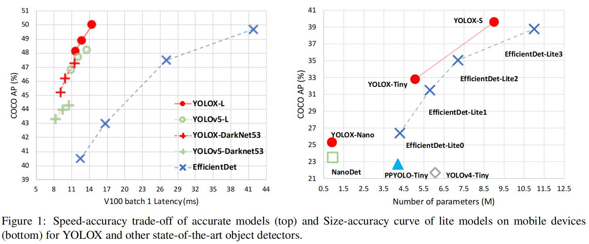

从这个图1中我们可以看出当前在大模型（左图）AP比较和小模型（右图）YOLOX的性能要好于其他的检测器。

## 2. YOLOX

### 2.1. YOLOX-DarkNet53

> We choose YOLOv3 with Darknet53 as our baseline.  

作者团队选用YOLOv3的Darknet53作为基准。

#### Implementation detail（实现细节）

**训练参数：**

1. 300个迭代中有5个迭代使用warm-up
2. 使用SGD，动量为0.9
3. 学习率 × 批量大小 / 64（线性缩放）的学习率，初始学习率为0.01和cosine lr schedule
4. 权重衰减为0.0005
5. batch size为128（8块GPU，1块GPU为16的batch size）

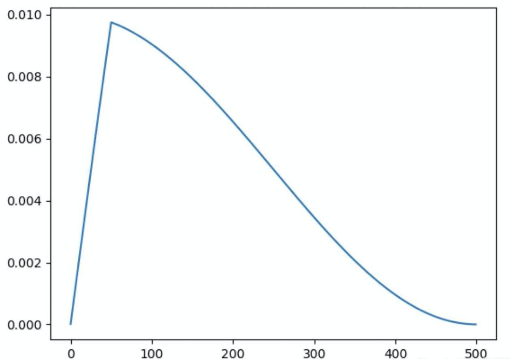

此图为学习率的变化，学习率是先做warm-up到一个较高的位置后，剩余的作余弦曲线递减

#### YOLOv3 baseline（YOLOv3 基线）

> adding EMA weights updating, cosine lr schedule, IoU loss and IoU-aware branch. We use BCE Loss for training cls and obj branch, and IoU Loss for training reg branch.

> we only conduct RandomHorizontalFlip, ColorJitter and multi-scale for data augmentation and discard the RandomResizedCrop strategy.

这里是对YOLOv3上进行方法的改进。

**使用的方法：**

EMA：指数移动平均

BCE Loss：二分类交叉熵损失

RandomHorizontalFlip：随机水平翻转

ColorJitter ：颜色抖动

**不使用的方法：**

RandomResizedCrop ：随机大小调整裁剪

#### Decoupled head（解耦头）

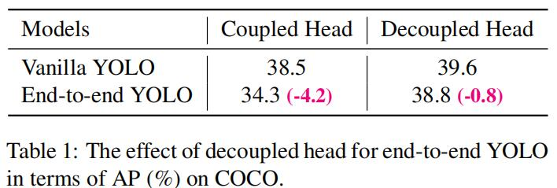

如表1所示，在端到端的YOLO在COCO中的表现显示，解耦头的AP尽管有所降低，但是相比于传统YOLO头降低比较少。

传统的YOLO在head部分是分类和回归在一个1 x 1的卷积中。而YOLOX中，head部分被分为两个部分，分别实现分类和回归，最后预测时再整合在一起。

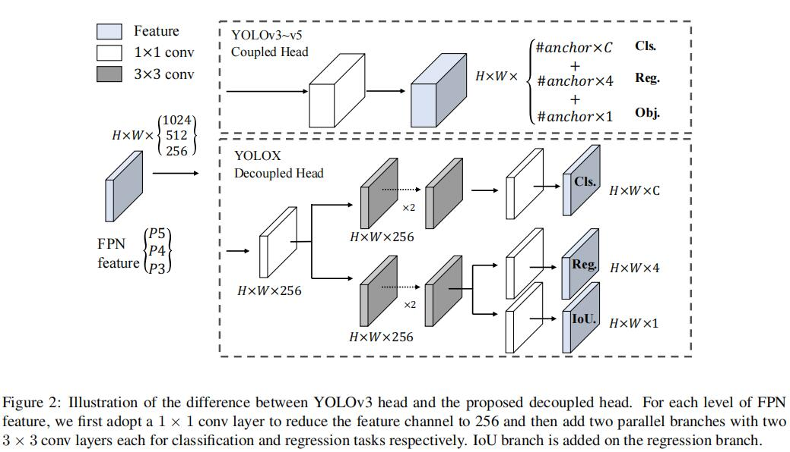

在**YOLOv3~v5 Coupled Head**中，如下图所示：

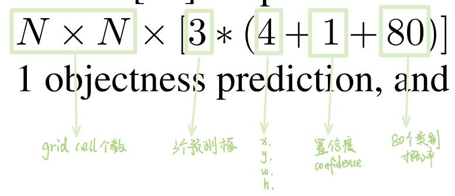

在**YOLOX Decoupled Head**中，分别有Cls（分类）、Reg（回归）和IoU三个部分。

**Cls：**判断每一个特征点所包含的物体种类

**Reg：**判断每一个特征点回归参数，调整后得到预测框

**IoU**：哦安短每一个特征点是否包含物体

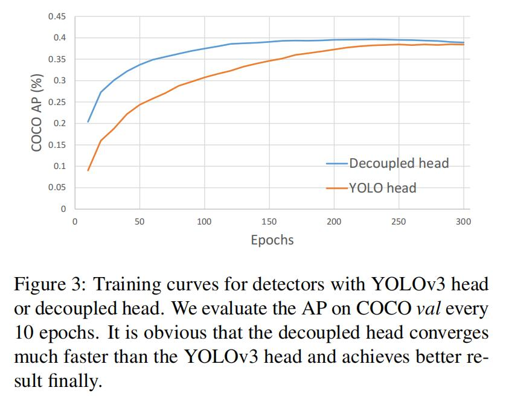

> It is obvious that the decoupled head converges much faster than the YOLOv3 head and achieves better result finally.

如图3所示，YOLOX的Decoupled Head比YOLOv3 Head收敛效果更好，AP指数更高。

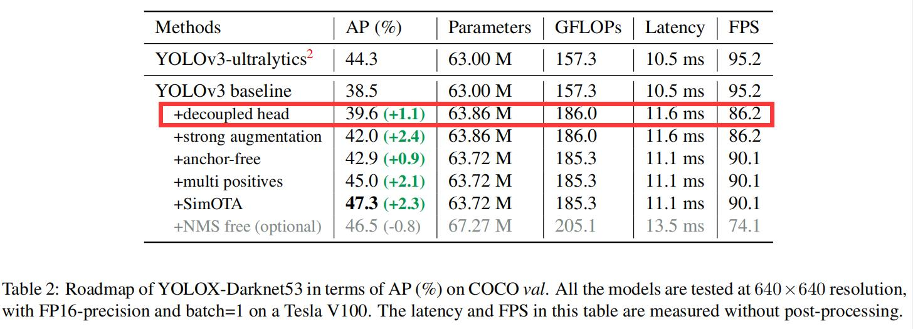

如表2所示，在YOLOv3使用解耦头后，AP相比baseline有1.1%的性能提升。

#### Strong data augmentation（强数据增强）

作者团队使用了Mosaic和MixUp两种数据增强形式，其中Mosaic数据增强是在[ultralytics-YOLOv3](https://github.com/ultralytics/yolov3)中提出的。作者在后15个迭代后关闭了增强方法，在使用中发现在ImageNet中该方法不是有益的。

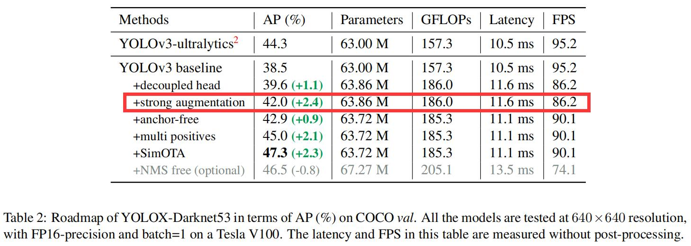

如表2所示，在YOLOv3使用两种数据增强后，AP相比baseline有2.4%的性能提升。

#### Anchor-free

**Anchor-based出现的问题：**

1. 聚类锚框没有通用性
2. 锚框增加检测头的复杂度并对图片增加了预测的数量

**Anchor-free的好处：**

1. 减少了检测器的参数和GFLOPs
2. 速度更快

Anchor-free的方法：[FOCS: Fully Convolutional One-stage Object Detection](https://arxiv.org/abs/1904.01355)

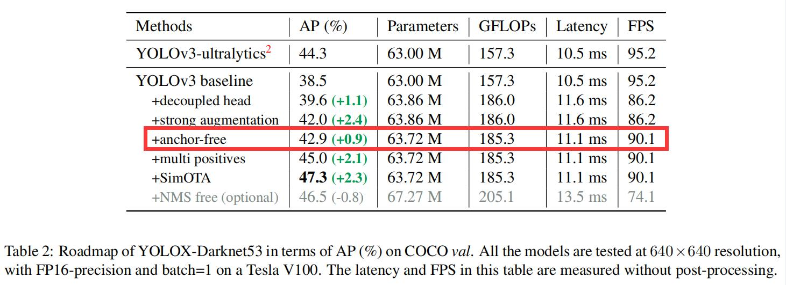

如表2所示，在YOLOv3使用Anchor-free后，AP相比baseline有0.9%的性能提升。

#### Multi positives

由于ground truth只有一个正样本，带来的问题是训练时间变长，收敛速度变慢。解决方法是增加正样本数量，从原先的one-to-one变为one-to-many。原先只考虑中心点位置网格，现在改为中心点周围3 x 3的区域网格都作为正样本。

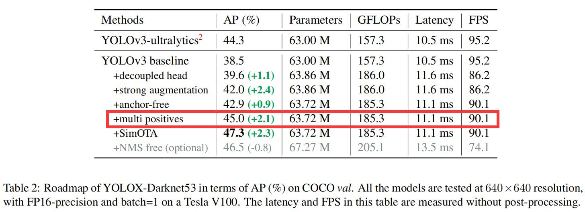

如表2所示，在YOLOv3使用Multi positives后，AP相比baseline有2.1%的性能提升。

#### SimOTA

当前高级标签分配策略是目标检测一个重要进展。由于[FOCS](https://arxiv.org/abs/1904.01355)可能会产生一个点对应多个物体导致歧义性，OTA是对于这种的一个解决办法。当作者团队在解决OT（Optimal Transport）问题时，发现在使用Sinkhorn-Knopp算法时会增加25%额外训练时间，对于300个迭代来说太贵了。所以为了作者简化动态前k个策略（dynamic k strategy），提出SimOTA。这种方法有以下好处：

1. 自动分析每个ground truth要拥有多少个正样本
2. 自动决定每个ground truth从哪个特征图检测
3. 相比于OTA，SimOTA速度更快
4. 相比于OTA，SimOTA能避免额外的超参数
5. 相比于OTA，SimOTA在绝大多数数据集下影响不大

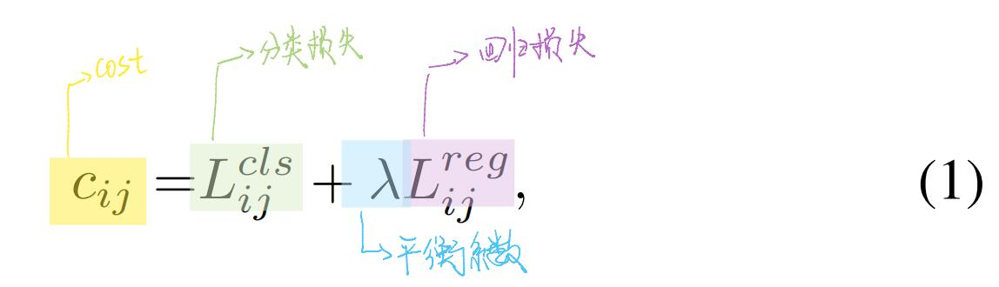

上述公式1是ground truth和预测值的计算成本。

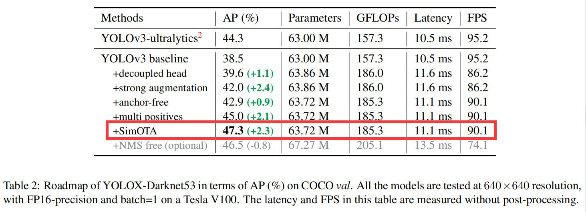

如表2所示，在YOLOv3使用SimOTA后，AP相比baseline有2.3%的性能提升。

### 2.2. Other Backbones（其他主干网络）

这一块主要说了YOLOX与其他检测器进行的比较。

## 3. Comparison with the SOTA

略

## 4. 1st Place on Streaming Perception Challenge(WAD at CVPR 2021)
略

## 5. Conclusion（结论）

1. 提出了一种新的检测器YOLOX
2. 提出了方法：解耦头（Decoupled head）、Anchor-free和高级标签分配策略（ advanced label assigning strategy）
3. 与其他检测器比较更好实现了速度与准确率的权衡
4. 提升了YOLOv3结构，使其在COCO中有更好的表现（AP提升）

